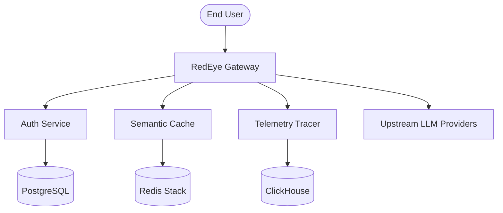

# 🦅 RedEye AI Engine

[](https://www.rust-lang.org)
[](LICENSE)
[](docker-compose.yml)

**RedEye AI Engine** is a high-performance, enterprise-grade AI Gateway and Policy Engine designed for secure, observable, and scalable LLM orchestration. Built with Rust for maximum efficiency and ClickHouse for multi-billion scale telemetry.

---

## 🏗️ Architecture Overview

RedEye acts as a centralized control plane for your AI infrastructure, providing authentication, rate-limiting, semantic caching, and deep observability across 30+ LLM providers.



---

## 🛠️ Tech Stack

- **L7 Gateway**: Rust (Axum, Tokio, Tower)
- **Primary Database**: PostgreSQL 16 with `pgvector` for vector storage
- **Caching & State**: Redis Stack 7.2 (Token Bucket Rate Limiting)
- **Telemetry & Audit**: ClickHouse 24.3 (Append-only immutable logs)
- **Frontend Controller**: React 19, Vite 8, Tailwind CSS 4, Framer Motion
- **Infrastructure**: Docker Compose with orchestrated healthchecks

---

## 🚀 Quick Start (The Golden Path)

Get up and running in under 2 minutes with our automated onboarding:

1. **Clone the repository:**
   ```bash
   git clone https://github.com/redeyegatewayofficial-admin/RedEye-Engine-Gateway.git
   cd RedEye-Engine-Gateway
   ```

2. **Run the One-Click Setup:**
   ```bash
   make setup
   ```
   *This script checks dependencies, provisions `.env`, and boots the Docker stack.*

3. **Start the Engine:**
   ```bash
   make run
   ```

---

## ⚙️ Environment Variables

Configuration is managed via `.env`. A template is provided in `.env.example`.

| Variable | Description | Default (Local) |
| :--- | :--- | :--- |
| `POSTGRES_DB` | Main database name | `RedEye` |
| `REDIS_PASSWORD` | Password for Redis authentication | `redis_secret` |
| `CLICKHOUSE_DB` | Telemetry database name | `RedEye_telemetry` |
| `GATEWAY_PORT` | Port for the main API gateway | `8080` |
| `JWT_SECRET` | Secret key for JWT signing | `change-me-in-production` |
| `RUST_LOG` | Logging level (`info`, `debug`, `trace`) | `info` |

---

## 📂 Repository Structure

- `/redeye_gateway`: Core L7 proxy and routing logic.
- `/redeye_auth`: Identity and Access Management (IAM).
- `/redeye_cache`: Semantic caching layer using vector embeddings.
- `/redeye_dashboard`: Modern administrative UI.
- `/infra`: Database seed scripts and configuration files.

---

## 📊 Benchmarks & Performance

RedEye is optimized for sub-millisecond overhead in the hot path.

- **Gateway Latency**: < 2ms (p99) overhead excluding upstream LLM time.
- **Throughput**: Supports 50,000+ RPS on standard horizontal scaling.
- **Telemetry Write Performance**: ClickHouse integration yields 1M+ events/sec swallow capacity.

---

## 📜 API Documentation & Usage

### 1. Authenticate Request
```bash
curl -X POST http://localhost:8080/v1/chat/completions \
  -H "Authorization: Bearer $RE_API_KEY" \
  -H "Content-Type: application/json" \
  -d '{"model": "gpt-4o", "messages": [{"role": "user", "content": "Hello RedEye!"}]}'
```

---

## 🤝 Contributing

We follow strict **Git Hygiene** and **Standardized Workflows**. Please ensure you run `make test` before submitting PRs.

1. Create a feature branch.
2. Commit changes (following Conventional Commits).
3. Submit a Pull Request.

---

*© 2026 RedEye AI. Built for the future of Sovereign AI.*
