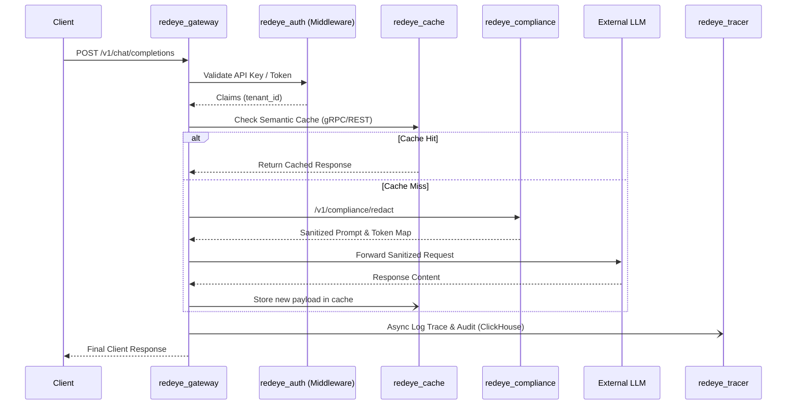

# RedEye AI Engine Architecture

## Overview
The RedEye AI Engine is a multi-tenant, high-performance API gateway and orchestration layer for interacting with Large Language Models (LLMs). It provides enterprise-ready features such as semantic caching, PII compliance redaction, observability, and dynamic LLM proxying.

## Microservices
1. **RedEye Gateway (`redeye_gateway`)**: The primary entry point. Handles rate limiting, authentication, load balancing, proxying, and streams responses back to clients. Exposes the main `/v1/chat/completions` proxy and management metrics.
2. **RedEye Auth (`redeye_auth`)**: Manages tenant workspaces, user registration (with passwords, OTP, OAuth), virtual API keys, upstream provider API keys securely, and issues JWT tokens.
3. **RedEye Cache (`redeye_cache`)**: A Layer-2 Semantic Cache (via gRPC & REST) that detects similar incoming prompts and serves cached completions to drastically reduce latency and LLM costs.
4. **RedEye Compliance (`redeye_compliance`)**: Handles data localized routing based on Data Privacy regulations and scrubs sensitive Personally Identifiable Information (PII) from prompts before they leave the environment.
5. **RedEye Tracer (`redeye_tracer`)**: Telemetry ingestion engine storing trace data, metrics, and compliance audit logs into ClickHouse for analytics and dashboard visualization.

## Request Lifecycle

The diagram below illustrates the exact path a request takes through the RedEye Engine microservices:

